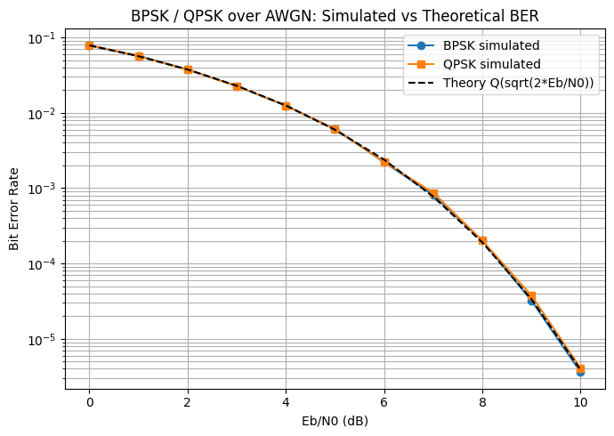
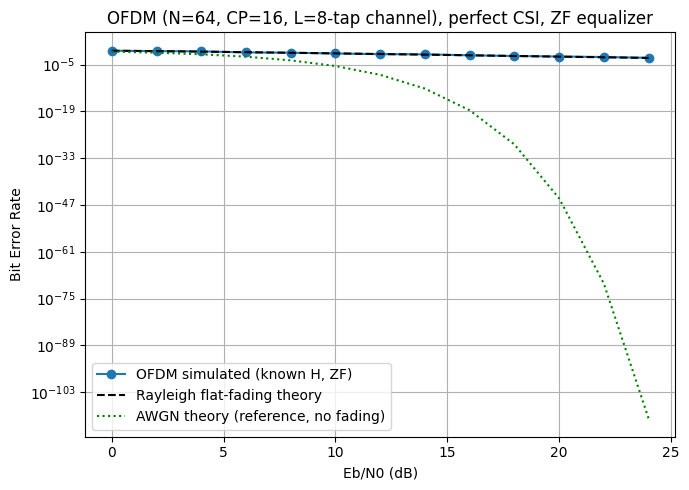
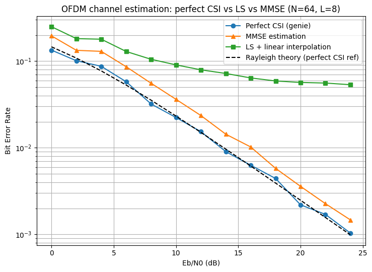
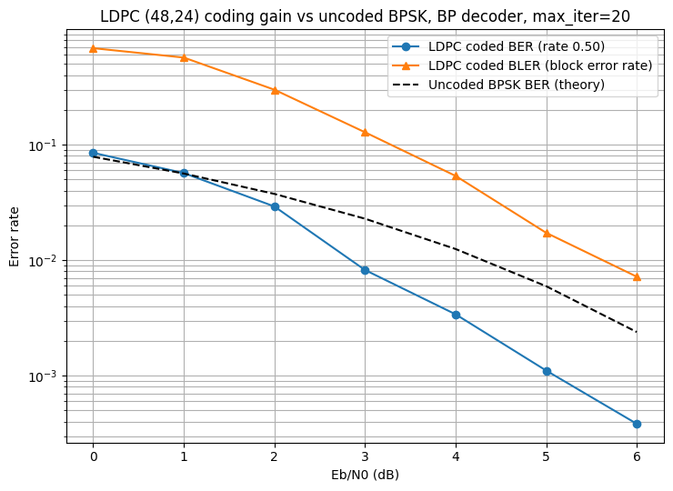
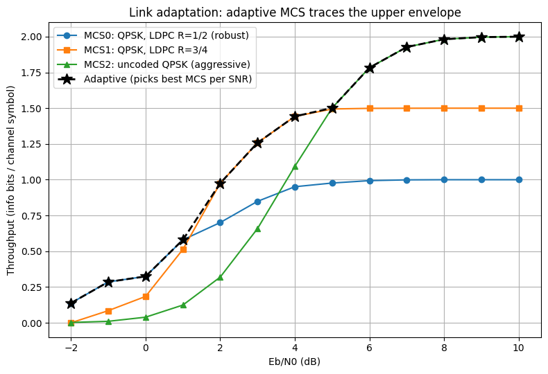
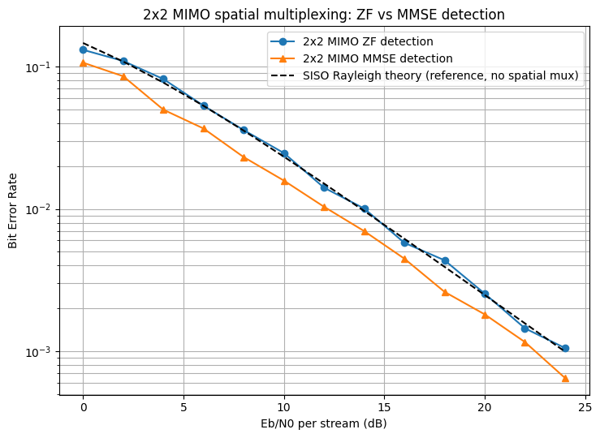
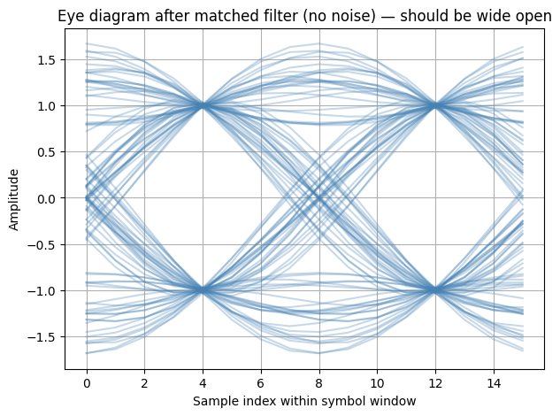

# 5G NR PHY Link-Level Simulator

A from-scratch physical-layer simulator covering the core building blocks of a 5G NR
modem: modulation, pulse shaping, OFDM, channel estimation, LDPC coding, link
adaptation, MIMO detection, and a bit-exact fixed-point C++ port of the baseline chain.

Every block (mapper, channel model, equalizer, decoder) is implemented from first
principles in Python/C++ — no `commpy`-style shortcuts — so each result is backed by
an understanding of the underlying math, not a library call.

## Why this project

Modem/PHY teams (Qualcomm, Samsung, MediaTek, Intel) interview on exactly this stack:
link budgets, channel estimation trade-offs, coding gain, MIMO detection, and
fixed-point implementation. This project builds and validates each piece against
closed-form theory, end to end.

## Pipeline overview

```
Bits → QPSK/BPSK mapper → RRC pulse shaping → OFDM (IFFT+CP) → multipath channel
     → AWGN → OFDM demod (FFT) → channel estimation (LS/MMSE) → equalization
     → LDPC decoding → bits
```

MIMO (2x2 spatial multiplexing) and link adaptation (AMC) are validated as separate,
isolated modules — see "Scope and limitations" for why they weren't folded into one
monolithic chain.

## Modules

| File | What it does | Validated against |
|---|---|---|
| `ber_awgn.py` | BPSK/QPSK mapper, demapper, AWGN channel | Theoretical `Q(sqrt(2·Eb/N0))` BER |
| `rrc_pulse_shaping.py` | Root-raised-cosine Tx/Rx filtering, matched filter, eye diagram | Same AWGN BER curve (pulse shaping must not cost BER) |
| `ofdm_known_channel.py` | OFDM (IFFT/CP/FFT), multipath channel, perfect-CSI ZF equalization | Closed-form Rayleigh flat-fading BER |
| `ofdm_channel_estimation.py` | Pilot-based LS (+interpolation) and MMSE channel estimation | Compared against the perfect-CSI baseline above |
| `ldpc_bp_decoder.py` | Systematic sparse LDPC encoder, sum-product (belief propagation) decoder | Coding gain vs. uncoded BPSK at matched Eb/N0 |
| `link_adaptation.py` | 3-MCS adaptive modulation & coding, throughput-maximizing selection | Adaptive curve traces the upper envelope of fixed-MCS curves |
| `mimo_2x2_detection.py` | 2x2 spatial multiplexing, ZF and MMSE detection | SISO Rayleigh theory (reference only — MIMO has different diversity behavior, see results) |
| `fixed_point_golden_model.py` + `fixed_point_chain.cpp` | Q1.15 fixed-point port of the QPSK+RRC chain, Python golden model vs. C++ | Bit-exact match, no noise (deterministic arithmetic validation) |

## Key results

- **BPSK/QPSK over AWGN**: simulated BER matches theory within simulation noise across 0–10 dB Eb/N0.
- **RRC pulse shaping**: identical BER to the unshaped case — confirms the Tx/Rx filter pair is lossless at the correct sampling instant (open eye diagram included).
- **OFDM over multipath**: matches closed-form Rayleigh BER; quantifies the fading penalty vs. AWGN (~15–20 dB worse at 10⁻³ BER).
- **Channel estimation**: MMSE tracks within ~2–3 dB of perfect CSI; LS+linear-interpolation hits a BLER/BER floor around 5×10⁻² at high SNR, caused by interpolation error (not noise) once pilot density is below the channel's Nyquist rate relative to its delay spread.
- **LDPC (N=48, K=24, rate 1/2)**: ~5x BER improvement over uncoded BPSK at 6 dB Eb/N0, with the expected "waterfall" shape. Small block length by design (demo speed) — see limitations.
- **Link adaptation**: adaptive MCS selection achieves ~1.5x throughput over a fixed robust MCS at 5 dB SNR by switching between 3 MCS levels based on measured BLER.
- **2x2 MIMO**: MMSE strictly beats ZF at every tested SNR; both show the expected diversity-order-1 asymptotic decay. Notably, MMSE crosses below the SISO Rayleigh reference at moderate-to-high SNR due to receive-diversity gain from the second antenna outweighing the interference-separation penalty.
- **Fixed-point C++ port**: bit-exact match (every intermediate Q1.15 sample, not just final bits) between the Python golden model and the C++ implementation.
- 
- 
- 
- 
- 
- 
- 

## Engineering notes (bugs found and fixed — not hidden)

Documenting these because catching them, not just getting a plot that "looks right," is
the actual skill being demonstrated:

1. **OFDM channel normalization bug**: initially force-normalized each random multipath
   channel realization to exactly unit energy. This suppressed deep fades and made
   simulated BER ~10–15% too optimistic versus Rayleigh theory — caught by tightening
   simulation statistics and noticing the error was *one-sided*, not random scatter.
   Fixed by giving each tap a fixed *expected* variance instead of forcing a fixed
   *realized* norm.
2. **RRC noise-scaling bug**: initially scaled AWGN variance by the oversampling factor
   when adding pulse shaping, reasoning (incorrectly) that spreading energy over more
   samples should scale up the noise. Since the RRC filter pair is unit-gain at the
   correct sampling instant, the correct noise variance is unchanged from the
   unshaped case.
3. **LDPC rate-loss accounting**: coding spends bandwidth — transmitting N coded bits
   to carry K information bits means less energy per useful bit. The Eb/N0 axis must
   be derated by the code rate (`Es/N0 = R × Eb/N0`) or the coding-gain comparison is
   not apples-to-apples.
4. **Fixed-point rounding convention**: Q1.15 multiplication requires an explicit
   round-to-nearest step (`(product + (1<<14)) >> 15`) before truncating back to 16
   bits — plain truncation introduces a systematic downward bias. Matching this
   convention exactly between Python and C++ was what made the bit-exact comparison
   pass.

## Scope and limitations (stated explicitly, not implied away)

- MIMO and link adaptation are validated as **standalone modules**, not combined with
  the OFDM+multipath chain (no MIMO-OFDM in this version).
- LDPC uses a small block length (N=48) for simulation speed; real 5G NR LDPC uses
  block lengths in the thousands with a correspondingly sharper waterfall and lower
  error floor.
- Link adaptation uses 3 illustrative MCS levels; 3GPP TS 38.214 defines ~15–29.
  16-QAM/64-QAM were not added (would require non-uniform LLR demapping).
- MMSE channel estimation assumes a known, uniform power-delay profile — real systems
  estimate or assume this rather than knowing it exactly.
- The fixed-point C++ port covers the baseline QPSK+RRC chain only (not OFDM/LDPC/MIMO)
  and validates the deterministic signal path (no noise — RNGs aren't portable
  bit-for-bit across languages).

## How to run

Each script is standalone (`python3 <script>.py`), designed to run in Google Colab or
any Python 3 environment with `numpy`, `scipy`, `matplotlib`. The C++ port requires a
C++17 compiler (`g++ -O2 -std=c++17 -o fixed_point_chain fixed_point_chain.cpp`).

## Tech stack

Python (numpy, scipy, matplotlib), C++17, free tools only (Google Colab / local Python,
g++). No paid software or licenses required to reproduce any result in this repo.
